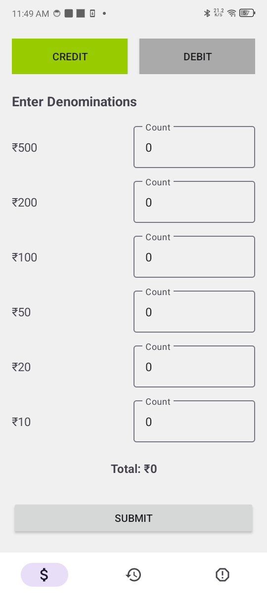
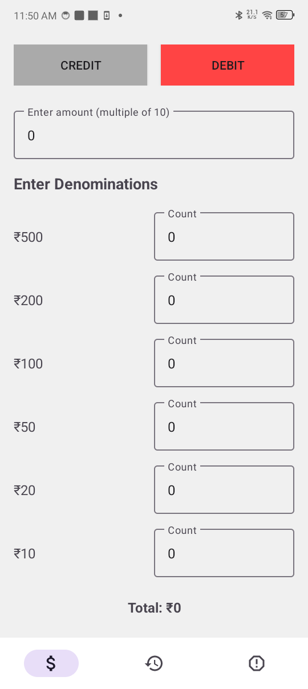
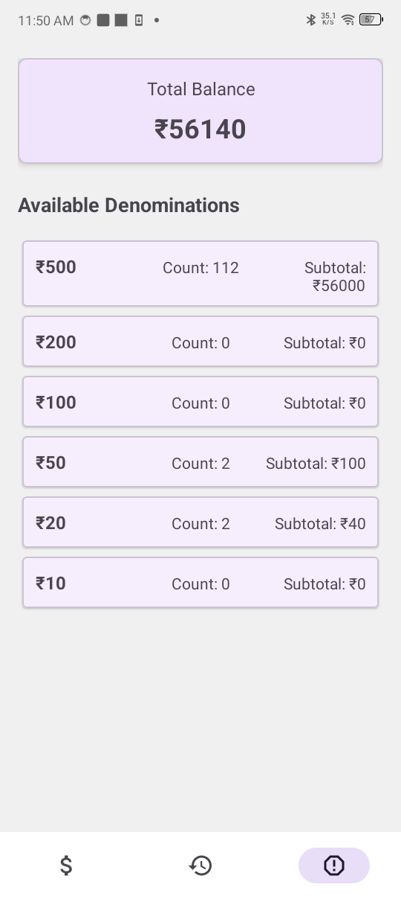

## Cash Machine Demo App 💰
A modern Android application that simulates a cash machine system with support for multiple denominations (₹500, ₹200, ₹100, ₹50, ₹20, ₹10). Built with MVVM architecture, Room Database, and Jetpack Compose.

📱 Screenshots
## App Screenshots

### Credit Transaction

### Debit Transaction

### Transaction History

### Total Balance Screen

## ✨ Features
💰 Credit Transactions: Add money with specific denomination breakdown

💸 Debit Transactions: Withdraw money with automatic denomination distribution

📊 Real-time Balance: Live balance tracking using LiveData

📝 Transaction History: Complete history of all transactions

🎯 Denomination Management: Support for ₹500, ₹200, ₹100, ₹50, ₹20, ₹10 notes

🔒 Input Validation: Comprehensive validation for amounts and denominations

🔄 Auto-calculation: Real-time total calculation as you input denominations

## 🛠️ Tech Stack
Kotlin - Programming language

MVVM Architecture - Model-View-ViewModel pattern

Room Database - Local persistence with SQLite

LiveData - Observable data holders for UI updates

ViewBinding - Type-safe view references

Coroutines - Asynchronous programming for database operations

Material Design - Modern UI components

AndroidX - Latest Android libraries

## 👨‍💻 Developer
Built with ❤️ using modern Android development practices. Perfect for learning MVVM, Room Database, and clean architecture patterns.

📞 Contact

👤 Name: Keval Koriya

📧 Email: kkoriya7610@gmail.com

📱 Phone: +91 95123 90868

Happy Coding! 🚀